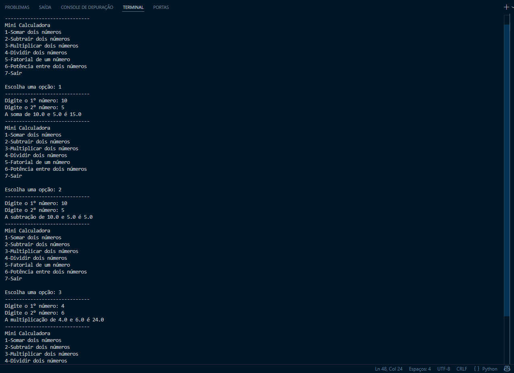
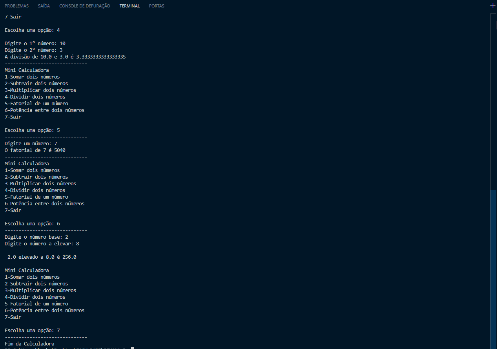

# 🧮 Mini Calculadora Interativa em Python

Projeto desenvolvido em Python com foco em lógica de programação, estruturas condicionais, laços de repetição e interação via terminal.

## 💻 Preview




## 🚀 Funcionalidades
- ➕ Soma
- ➖ Subtração
- ✖️ Multiplicação
- ➗ Divisão com validação de zero
- 🧠 Fatorial de número inteiro
- ⚡ Potência
- 🔁 Menu interativo
- ❌ Encerramento do programa

## ▶️ Como executar
```bash
python main.py
